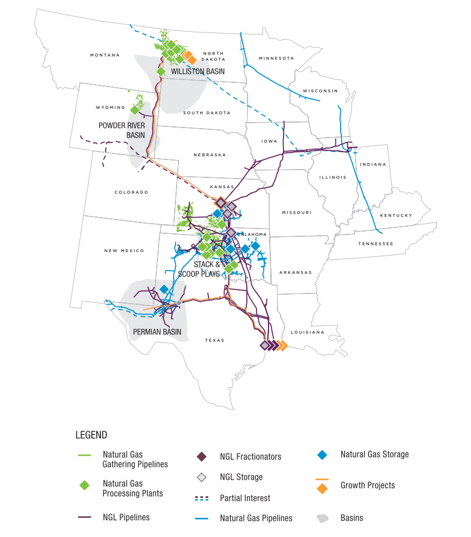
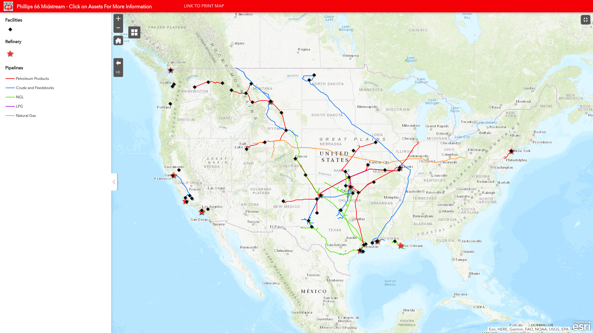

---
jupyter:
  jupytext:
    formats: ipynb,Rmd
    text_representation:
      extension: .Rmd
      format_name: rmarkdown
      format_version: '1.1'
      jupytext_version: 1.2.1
  kernelspec:
    display_name: R 3.6.1
    language: R
    name: ir361
---

<!-- #region {"slideshow": {"slide_type": "slide"}} -->
# Explore data variance
<!-- #endregion -->


<!-- #region {"slideshow": {"slide_type": "slide"}} -->
## Setup
<!-- #endregion -->

```{r slideshow={'slide_type': 'subslide'}}
sample_file <- "sample_combined_2019-09-16.feather"
```

```{r}
library(DataAnalysisTools)
library(tidyverse)
library(oildata)
library(gridExtra)
```

```{r}
set.seed(6)
```

```{r}
options(repr.plot.width=7, repr.plot.height=5.5)
```

<!-- #region {"slideshow": {"slide_type": "subslide"}} -->
## Load data
<!-- #endregion -->

```{r slideshow={'slide_type': 'subslide'}}
sample <- feather::read_feather(sample_file)
sample_n(sample, 5)
```

```{r}
pipelines <- oildata::pipelines
sample_n(pipelines, 5)
```

<!-- #region {"slideshow": {"slide_type": "subslide"}} -->
## Add missing names
<!-- #endregion -->

```{r slideshow={'slide_type': 'subslide'}}
sample$Name <- oildata::add_company_names(sample$OPERATOR_ID)
head(sample)
```

<!-- #region {"slideshow": {"slide_type": "slide"}} -->
## Dataset overview
<!-- #endregion -->

<!-- #region {"slideshow": {"slide_type": "subslide"}} -->
### 1 - Pipelines raw datasets
<!-- #endregion -->

* Different reporting rules (and datasets) for different periods of time.
* Companies file separate reports for separate commodities being transported.
* For historical reasons, some companies file separate reports for separate parts of the company, sometimes under the same ID, sometimes under separate IDs.
* Many things are inconsistent between datasets (e.g., commodities, variable names).

```{r slideshow={'slide_type': 'notes'}}
sample_n(pipelines_2010, 5)
```

```{r}
sample_n(pipelines_2004, 5)
```

<!-- #region {"slideshow": {"slide_type": "subslide"}} -->
### 2 - Company groups and M&As
<!-- #endregion -->

* I looked up all M&As and ownership on LexisNexis.
* Requires manual definition of aggregation rules.
* Aggregation takes place twice just for data on pipeline network: within companies, and for company groupings.
* In addition, might need to aggregate between commodities.

```{r}
sample_n(m_as, 5)
```

<!-- #region {"slideshow": {"slide_type": "subslide"}} -->
### 3 - Pipeline incidents
<!-- #endregion -->

* Pipeline incidents are reported in a separate dataset.
* Each incident is a separate observation in that dataset.
* Obviously, aggregation is required again to obtain the number of incident per organization/commodity/year.

```{r}
sample_n(select(incidents_2010, -narrative), 5)
```

<!-- #region {"slideshow": {"slide_type": "subslide"}} -->
Rich data, e.g.:
<!-- #endregion -->

```{r slideshow={'slide_type': 'subslide'}}
sample_n(incidents_2010, 1)$narrative
```

```{r}
sample_n(incidents_2010, 1)$narrative
```

<!-- #region {"slideshow": {"slide_type": "slide"}} -->
## Data consistency
<!-- #endregion -->

```{r slideshow={'slide_type': 'subslide'}}
data_consistency <- pipelines %>%
    filter(!(commodity %in% c("CO2 OR OTHER", "CO2", "fge"))) %>%
    select(hca_onshore, hca_total, total_onshore, total_miles, year, commodity) %>%
    pivot_longer(-c(year, commodity), names_to = "variable", values_to = "miles") %>%
    group_by(year, commodity, variable) %>%
    summarize(miles = sum(miles, na.rm = TRUE)) %>%
    ggplot(aes(x=year, y=miles, color=commodity)) +
        facet_wrap(variable ~ .) +
        geom_line()
```

```{r slideshow={'slide_type': 'subslide'}}
print(data_consistency)
```

<!-- #region {"slideshow": {"slide_type": "slide"}} -->
## Grab largest companies
<!-- #endregion -->

<!-- #region {"slideshow": {"slide_type": "subslide"}} -->
### Largest operators by total miles
<!-- #endregion -->

```{r}
largest_companies <- sample %>%
    group_by(Name) %>%
    filter(TOTAL_MILES == max(TOTAL_MILES)) %>%
    ungroup() %>%
    mutate(Name = fct_reorder(Name, TOTAL_MILES)) %>%
    arrange(desc(TOTAL_MILES)) %>%
    select(Name, TOTAL_MILES, OPERATOR_ID)

head(largest_companies) %>%
    jupyter_styling(font_size = 16)
```

```{r}
largest_companies_plot <- largest_companies %>%
    top_n(35, TOTAL_MILES) %>%
    ggplot(aes(x = TOTAL_MILES, y = Name)) +
        geom_point()
```

```{r slideshow={'slide_type': 'subslide'}}
print(largest_companies_plot)
```

```{r slideshow={'slide_type': 'subslide'}}
largest <- top_n(largest_companies, 6, TOTAL_MILES) %>%
    left_join(pipelines, by = c("OPERATOR_ID" = "ID")) %>%
    rename(ID = OPERATOR_ID) %>%
    select(-Name, name) %>%
    mutate(name = oildata::add_company_names(ID))
sample_n(largest, 5)
```

<!-- #region {"slideshow": {"slide_type": "slide"}} -->
## Qualitative
<!-- #endregion -->

<!-- #region {"slideshow": {"slide_type": "subslide"}} -->
## Industry-wide trends

* Good short-term outlook.
* Mid-term: threat of regulations.
* Money being pulled out of many businesses.
* No initiatives to diversify.
* The top 3 companies listed below are not in direct competition (different sub-industries).
<!-- #endregion -->

<!-- #region {"slideshow": {"slide_type": "subslide"}} -->
### Enterprise Products Operating

* Fortune # 105 (2018).
* Family-owned, publicly traded company (Duncan family).
* Dan Duncan founded EPO in 1968 and was CEO until 2010.
* Current CEO: Randas Duncan WIlliams.
* Wikipedia highlights several explosions 2011-2017.
* Natural gas midstream company (HVL)
* In addition to pipelines, owns storage facilities, 24 natural gas processing platns, six offshore hub platforms, etc.
* States primaru focus on shale gas in company statement.

----

Midstream company: selling to other companies
<!-- #endregion -->

<!-- #region {"slideshow": {"slide_type": "subslide"}} -->

<!-- #endregion -->

<!-- #region {"slideshow": {"slide_type": "subslide"}} -->
### ONEOK

* Natural gas utility.
* Forbes #630 (2019).
* Aqcuired NGL systems from Koch Industries in 2005.
* Spun out distribution business (consumer business unit) in 2014) - still under ONEOK ownership (?).


----

Utility company*: selling to consumers

\* Also owns some midstream assets
<!-- #endregion -->

<!-- #region {"slideshow": {"slide_type": "subslide"}} -->

<!-- #endregion -->

```{r slideshow={'slide_type': 'subslide'}}
subset(m_as, group_name == "ONEOK (Group)") %>%
    mutate(name = oildata::add_company_names(members, pipelines_2004))
```

```{r}
ONEOK_construction <- pipelines %>%
    filter(ID == "ONEOK (Group)") %>%
    ggplot(aes(x=year, y=total_miles, color=commodity)) +
        geom_line()
```

```{r slideshow={'slide_type': 'subslide'}}
print(ONEOK_construction)
```

Acquisition probably does not show up because it was acquired as a whole.

```{r slideshow={'slide_type': 'subslide'}}
pipelines_2004 %>%
    filter(ID %in% c(32109, 30629)) %>%
    select(ID, year, name) %>%
    jupyter_styling(font_size = 16)
```

<!-- #region {"slideshow": {"slide_type": "subslide"}} -->
### Phillips 66

* Spun off by ConocoPhillip in 2012.
* Forbes #23 (2018).
* Phllips: America-based, internationally active company (e.g., extraction in North Sea).
* Phillips (predecessor) experienced high-profile incidents in 1980, 1989, and 1999.
* Apart from midstream activities, also engages in chemicals, refining, and marketing (gas stations).
----
Downstream and midstream, diversified
<!-- #endregion -->

<!-- #region {"slideshow": {"slide_type": "subslide"}} -->

<!-- #endregion -->

<!-- #region {"slideshow": {"slide_type": "slide"}} -->
## Information from the dataset
<!-- #endregion -->

<!-- #region {"slideshow": {"slide_type": "subslide"}} -->
### Product mix - pipelines types
<!-- #endregion -->

```{r}
product_mix <- largest %>%
    pivot_wider(names_from = commodity, values_from = total_miles, id_cols = c(year, ID)) %>%
    select(year, ID, non_hvl, crude, hvl) %>%
    group_by(year, ID) %>%
    summarize(non_hvl = sum(non_hvl, na.rm = T), 
              crude = sum(crude, na.rm = T), 
              hvl = sum(hvl, na.rm = T)) %>%
    ungroup() %>%
    mutate(total = non_hvl + crude + hvl) %>%
    mutate(perc_non_hvl = non_hvl / total, 
           perc_crude = crude / total, 
           perc_hvl = hvl / total) %>%
    mutate(name = oildata::add_company_names(ID))
sample_n(product_mix, 5)
```

```{r slideshow={'slide_type': 'subslide'}}
product_mix_plot <- product_mix %>%
    pivot_longer(starts_with("perc"), names_to = "commodity") %>%
    ggplot(aes(x = year, y = value, color = commodity)) +
        facet_wrap(~name) +
        geom_line()
```

```{r slideshow={'slide_type': 'subslide'}}
print(product_mix_plot)
```

```{r slideshow={'slide_type': 'subslide'}}
construction <- largest %>%
    filter(commodity %in% c("crude", "hvl", "non_hvl")) %>%
    ggplot(aes(x=year, y=total_miles, color=commodity)) +
        facet_wrap(~name) +
        geom_line()
```

```{r slideshow={'slide_type': 'subslide'}}
print(construction)
```

<!-- #region {"slideshow": {"slide_type": "subslide"}} -->
### Incident trends
<!-- #endregion -->

```{r}
incident_counts <- pipelines %>%
    mutate(name = oildata::add_company_names(ID)) %>%
    filter(name %in% largest$name) %>%
    ggplot(aes(x=year, y=significant_incidents)) + 
        facet_wrap(~ name) +
        geom_col()
```

```{r slideshow={'slide_type': 'subslide'}}
print(incident_counts)
```

<!-- #region {"slideshow": {"slide_type": "subslide"}} -->
### Relationships
<!-- #endregion -->

```{r}
largest_4 <- top_n(largest_companies, 4, TOTAL_MILES)
largest_4
```

```{r slideshow={'slide_type': 'subslide'}}
miles <- pipelines %>%
    filter(ID == 31618) %>%
    mutate(ID = "Enterprise Products Operating") %>%
    ggplot(aes(x=year, y=total_miles)) +
        facet_wrap(~ commodity) +
        geom_line() +
        geom_smooth(method = "lm", se = FALSE) +
        labs(title = "Enterprise Products Operating") +
        theme(axis.title.x = element_blank(),
              axis.text.x=element_blank(), 
              axis.ticks.x = element_blank(),
              plot.title = element_text(size=10),
              plot.margin = margin(t = 0, r = 0, b = 0, l = 0, unit = "pt"))

incidents <- pipelines %>%
    filter(ID == 31618) %>%
    mutate(ID = "Enterprise Products Operating") %>%
    ggplot(aes(x=year, y=significant_incidents)) +
        facet_wrap(~ commodity) +
        geom_col() +
        geom_smooth(method = "lm", se = FALSE) +
        theme(axis.title.x = element_blank(),
              axis.text.x=element_blank(), 
              axis.ticks.x = element_blank(),
              plot.margin = margin(t = 0, r = 0, b = 0, l = 0, unit = "pt"))

miles_smooth <- pipelines %>%
    filter(ID == 31618) %>%
    mutate(ID = "Enterprise Products Operating") %>%
    ggplot(aes(x=year, y=total_miles)) +
        facet_wrap(~ commodity) +
        geom_line() +
        geom_smooth(method = "loess", se = FALSE) +
        labs(title = "Enterprise Products Operating") +
        theme(axis.title.x = element_blank(),
              axis.text.x=element_blank(), 
              axis.ticks.x = element_blank(),
              plot.title = element_text(size=10),
              plot.margin = margin(t = 0, r = 0, b = 0, l = 0, unit = "pt"))

incidents_smooth <- pipelines %>%
    filter(ID == 31618) %>%
    mutate(ID = "Enterprise Products Operating") %>%
    ggplot(aes(x=year, y=significant_incidents)) +
        facet_wrap(~ commodity) +
        geom_col() +
        geom_smooth(method = "loess", se = FALSE) +
        theme(axis.title.x = element_blank(),
              axis.text.x=element_blank(), 
              axis.ticks.x = element_blank(),
              plot.margin = margin(t = 0, r = 0, b = 0, l = 0, unit = "pt"))
```

```{r slideshow={'slide_type': 'subslide'}}
grid.arrange(miles, incidents, miles_smooth, incidents_smooth, ncol = 1)
```

```{r slideshow={'slide_type': 'skip'}, jupyter={'source_hidden': True}}
miles <- pipelines %>%
    filter(ID == "ONEOK (Group)") %>%
    ggplot(aes(x=year, y=total_miles)) +
        facet_wrap(~ commodity) +
        geom_line() +
        geom_smooth(method = "lm", se = FALSE) +
        labs(title = "ONEOK (Group)") +
        theme(axis.title.x = element_blank(),
              axis.text.x=element_blank(), 
              axis.ticks.x = element_blank(),
              plot.title = element_text(size=10),
              plot.margin = margin(t = 0, r = 0, b = 0, l = 0, unit = "pt"))

incidents <- pipelines %>%
    filter(ID == "ONEOK (Group)") %>%
    ggplot(aes(x=year, y=significant_incidents)) +
        facet_wrap(~ commodity) +
        geom_col() +
        geom_smooth(method = "lm", se = FALSE) +
        theme(axis.title.x = element_blank(),
              axis.text.x=element_blank(), 
              axis.ticks.x = element_blank(),
              plot.margin = margin(t = 0, r = 0, b = 0, l = 0, unit = "pt"))

miles_smooth <- pipelines %>%
    filter(ID == "ONEOK (Group)") %>%
    ggplot(aes(x=year, y=total_miles)) +
        facet_wrap(~ commodity) +
        geom_line() +
        geom_smooth(method = "loess", se = FALSE) +
        theme(axis.title.x = element_blank(),
              axis.text.x=element_blank(), 
              axis.ticks.x = element_blank(),
              plot.title = element_text(size=10),
              plot.margin = margin(t = 0, r = 0, b = 0, l = 0, unit = "pt"))

incidents_smooth <- pipelines %>%
    filter(ID == "ONEOK (Group)") %>%
    ggplot(aes(x=year, y=significant_incidents)) +
        facet_wrap(~ commodity) +
        geom_col() +
        geom_smooth(method = "loess", se = FALSE) +
        theme(axis.title.x = element_blank(),
              axis.text.x=element_blank(), 
              axis.ticks.x = element_blank(),
              plot.margin = margin(t = 0, r = 0, b = 0, l = 0, unit = "pt"))
```

```{r slideshow={'slide_type': 'subslide'}}
grid.arrange(miles, incidents, miles_smooth, incidents_smooth, ncol = 1)
```

```{r slideshow={'slide_type': 'skip'}, jupyter={'source_hidden': True}}
miles <- pipelines %>%
    filter(ID == "Phillips 66 (Group)") %>%
    ggplot(aes(x=year, y=total_miles)) +
        facet_wrap(~ commodity) +
        geom_line() +
        geom_smooth(method = "lm", se = FALSE) +
        labs(title = "Phillips 66 (Group)") +
        theme(axis.title.x = element_blank(),
              axis.text.x=element_blank(), 
              axis.ticks.x = element_blank(),
              plot.title = element_text(size=10),
              plot.margin = margin(t = 0, r = 0, b = 0, l = 0, unit = "pt"))

incidents <- pipelines %>%
    filter(ID == "Phillips 66 (Group)") %>%
    ggplot(aes(x=year, y=significant_incidents)) +
        facet_wrap(~ commodity) +
        geom_col() +
        geom_smooth(method = "lm", se = FALSE) +
        theme(axis.title.x = element_blank(),
              axis.text.x=element_blank(), 
              axis.ticks.x = element_blank(),
              plot.margin = margin(t = 0, r = 0, b = 0, l = 0, unit = "pt"))

miles_smooth <- pipelines %>%
    filter(ID == "Phillips 66 (Group)") %>%
    ggplot(aes(x=year, y=total_miles)) +
        facet_wrap(~ commodity) +
        geom_line() +
        geom_smooth(method = "loess", se = FALSE) +
        theme(axis.title.x = element_blank(),
              axis.text.x=element_blank(), 
              axis.ticks.x = element_blank(),
              plot.title = element_text(size=10),
              plot.margin = margin(t = 0, r = 0, b = 0, l = 0, unit = "pt"))

incidents_smooth <- pipelines %>%
    filter(ID == "Phillips 66 (Group)") %>%
    ggplot(aes(x=year, y=significant_incidents)) +
        facet_wrap(~ commodity) +
        geom_col() +
        geom_smooth(method = "loess", se = FALSE) +
        theme(axis.title.x = element_blank(),
              axis.text.x=element_blank(), 
              axis.ticks.x = element_blank(),
              plot.margin = margin(t = 0, r = 0, b = 0, l = 0, unit = "pt"))
```

```{r slideshow={'slide_type': 'subslide'}}
grid.arrange(miles, incidents, miles_smooth, incidents_smooth, ncol = 1)
```

<!-- #region {"slideshow": {"slide_type": "slide"}} -->
### Incidents per mile
<!-- #endregion -->

```{r slideshow={'slide_type': 'subslide'}}
incidents_per_mile <- oildata::pipelines %>%
    mutate(name = oildata::add_company_names(ID)) %>%
    filter(name %in% largest$name) %>%
    group_by(year, name) %>%
    summarize(incidents_per_mile = sum(significant_incidents, na.rm = T) / sum(total_miles, na.rm = T), 
              total_miles = sum(total_miles, na.rm = T))
```

```{r}
incidents_per_mile_graphed <- incidents_per_mile %>%
    ggplot(aes(x=year, y=incidents_per_mile)) + 
        facet_wrap(~ name) +
        geom_col()
```

```{r slideshow={'slide_type': 'subslide'}}
print(incidents_per_mile_graphed)
```

```{r slideshow={'slide_type': 'subslide'}}
incidents_per_mile2 <- oildata::pipelines %>%
    mutate(name = oildata::add_company_names(ID)) %>%
    filter(name %in% largest$name) %>%
    group_by(year, name, commodity) %>%
    summarize(incidents_per_mile = sum(significant_incidents, na.rm = T) / sum(total_miles, na.rm = T), 
              total_miles = sum(total_miles, na.rm = T))
```

```{r}
miles <- incidents_per_mile2 %>%
    filter(name == "Enterprise Products Operating") %>%
    ggplot(aes(x=year, y=total_miles)) +
        facet_wrap(~ commodity) +
        geom_line() +
        geom_smooth(method = "lm", se = FALSE) +
        labs(title = "Enterprise Products Operating") +
        theme(axis.title.x = element_blank(),
              axis.text.x=element_blank(), 
              axis.ticks.x = element_blank(),
              plot.title = element_text(size=10),
              plot.margin = margin(t = 0, r = 0, b = 0, l = 0, unit = "pt"))

incidents <- incidents_per_mile2 %>%
    filter(name == "Enterprise Products Operating") %>%
    ggplot(aes(x=year, y=incidents_per_mile)) +
        facet_wrap(~ commodity, scale = "free") +
        geom_line() +
        geom_smooth(method = "lm", se = FALSE) +
        theme(axis.title.x = element_blank(),
              axis.text.x=element_blank(), 
              axis.ticks.x = element_blank(),
              plot.margin = margin(t = 0, r = 0, b = 0, l = 0, unit = "pt"))

miles_smooth <- incidents_per_mile2 %>%
    filter(name == "Enterprise Products Operating") %>%
    ggplot(aes(x=year, y=total_miles)) +
        facet_wrap(~ commodity) +
        geom_line() +
        geom_smooth(method = "loess", se = FALSE) +
        theme(axis.title.x = element_blank(),
              axis.text.x=element_blank(), 
              axis.ticks.x = element_blank(),
              plot.title = element_text(size=10),
              plot.margin = margin(t = 0, r = 0, b = 0, l = 0, unit = "pt"))

incidents_smooth <- incidents_per_mile2 %>%
    filter(name == "Enterprise Products Operating") %>%
    ggplot(aes(x=year, y=incidents_per_mile)) +
        facet_wrap(~ commodity, scale = "free") +
        geom_line() +
        geom_smooth(method = "loess", se = FALSE) +
        theme(axis.title.x = element_blank(),
              axis.text.x=element_blank(), 
              axis.ticks.x = element_blank(),
              plot.margin = margin(t = 0, r = 0, b = 0, l = 0, unit = "pt"))
```

```{r slideshow={'slide_type': 'subslide'}}
grid.arrange(miles, incidents, miles_smooth, incidents_smooth, ncol = 1)
```

```{r slideshow={'slide_type': 'skip'}, jupyter={'source_hidden': True}}
miles <- incidents_per_mile2 %>%
    filter(name == "ONEOK (Group)") %>%
    ggplot(aes(x=year, y=total_miles)) +
        facet_wrap(~ commodity) +
        geom_line() +
        geom_smooth(method = "lm", se = FALSE) +
        labs(title = "ONEOK (Group)") +
        theme(axis.title.x = element_blank(),
              axis.text.x=element_blank(), 
              axis.ticks.x = element_blank(),
              plot.title = element_text(size=10),
              plot.margin = margin(t = 0, r = 0, b = 0, l = 0, unit = "pt"))

incidents <- incidents_per_mile2 %>%
    filter(name == "ONEOK (Group)") %>%
    ggplot(aes(x=year, y=incidents_per_mile)) +
        facet_wrap(~ commodity, scale = "free") +
        geom_line() +
        geom_smooth(method = "lm", se = FALSE) +
        theme(axis.title.x = element_blank(),
              axis.text.x=element_blank(), 
              axis.ticks.x = element_blank(),
              plot.margin = margin(t = 0, r = 0, b = 0, l = 0, unit = "pt"))

miles_smooth <- incidents_per_mile2 %>%
    filter(name == "ONEOK (Group)") %>%
    ggplot(aes(x=year, y=total_miles)) +
        facet_wrap(~ commodity) +
        geom_line() +
        geom_smooth(method = "loess", se = FALSE) +
        theme(axis.title.x = element_blank(),
              axis.text.x=element_blank(), 
              axis.ticks.x = element_blank(),
              plot.title = element_text(size=10),
              plot.margin = margin(t = 0, r = 0, b = 0, l = 0, unit = "pt"))

incidents_smooth <- incidents_per_mile2 %>%
    filter(name == "ONEOK (Group)") %>%
    ggplot(aes(x=year, y=incidents_per_mile)) +
        facet_wrap(~ commodity, scale = "free") +
        geom_line() +
        geom_smooth(method = "loess", se = FALSE) +
        theme(axis.title.x = element_blank(),
              axis.text.x=element_blank(), 
              axis.ticks.x = element_blank(),
              plot.margin = margin(t = 0, r = 0, b = 0, l = 0, unit = "pt"))
```

```{r slideshow={'slide_type': 'subslide'}}
grid.arrange(miles, incidents, miles_smooth, incidents_smooth, ncol = 1)
```

```{r slideshow={'slide_type': 'skip'}}
miles <- incidents_per_mile2 %>%
    filter(name == "Phillips 66 (Group)") %>%
    ggplot(aes(x=year, y=total_miles)) +
        facet_wrap(~ commodity) +
        geom_line() +
        geom_smooth(method = "lm", se = FALSE) +
        labs(title = "Phillips 66 (Group)") +
        theme(axis.title.x = element_blank(),
              axis.text.x=element_blank(), 
              axis.ticks.x = element_blank(),
              plot.title = element_text(size=10),
              plot.margin = margin(t = 0, r = 0, b = 0, l = 0, unit = "pt"))

incidents <- incidents_per_mile2 %>%
    filter(name == "Phillips 66 (Group)") %>%
    ggplot(aes(x=year, y=incidents_per_mile)) +
        facet_wrap(~ commodity, scale = "free") +
        geom_line() +
        geom_smooth(method = "lm", se = FALSE) +
        theme(axis.title.x = element_blank(),
              axis.text.x=element_blank(), 
              axis.ticks.x = element_blank(),
              plot.margin = margin(t = 0, r = 0, b = 0, l = 0, unit = "pt"))

miles_smooth <- incidents_per_mile2 %>%
    filter(name == "Phillips 66 (Group)") %>%
    ggplot(aes(x=year, y=total_miles)) +
        facet_wrap(~ commodity) +
        geom_line() +
        geom_smooth(method = "loess", se = FALSE) +
        theme(axis.title.x = element_blank(),
              axis.text.x=element_blank(), 
              axis.ticks.x = element_blank(),
              plot.title = element_text(size=10),
              plot.margin = margin(t = 0, r = 0, b = 0, l = 0, unit = "pt"))

incidents_smooth <- incidents_per_mile2 %>%
    filter(name == "Phillips 66 (Group)") %>%
    ggplot(aes(x=year, y=incidents_per_mile)) +
        facet_wrap(~ commodity, scale = "free") +
        geom_line() +
        geom_smooth(method = "loess", se = FALSE) +
        theme(axis.title.x = element_blank(),
              axis.text.x=element_blank(), 
              axis.ticks.x = element_blank(),
              plot.margin = margin(t = 0, r = 0, b = 0, l = 0, unit = "pt"))
```

```{r slideshow={'slide_type': 'subslide'}}
grid.arrange(miles, incidents, miles_smooth, incidents_smooth, ncol = 1)
```

<!-- #region {"slideshow": {"slide_type": "slide"}} -->
## Other variables
<!-- #endregion -->

<!-- #region {"slideshow": {"slide_type": "subslide"}} -->
### Pipeline age
<!-- #endregion -->

```{r}
sample_n(sample, 5)
```

<!-- #region {"slideshow": {"slide_type": "subslide"}} -->
### Other variables
* Inspections, actions taken
* Nominal pipe size, weld
* Minimum yield strength
* Corosion prevention status
* HCAs
* No location data for pipelines :( only for incidents
<!-- #endregion -->

<!-- #region {"slideshow": {"slide_type": "slide"}} -->
### Incidents
<!-- #endregion -->

```{r slideshow={'slide_type': 'subslide'}}
incidents <- oildata::incidents
sample_n(incidents, 5)
```

```{r}
cause_counts <- incidents %>%
    group_by(year, ID, commodity) %>%
    count(cause) %>%
    ungroup() %>%
    group_by(year, ID, cause) %>%
    summarize(n = sum(n, na.rm = T)) %>%
    ungroup()
sample_n(cause_counts, 5)
```

```{r slideshow={'slide_type': 'subslide'}}
print(construction)
```

```{r slideshow={'slide_type': 'subslide'}}
epo_causes <- cause_counts %>%
    filter(ID == 31618) %>%
    ggplot(aes(x = year, y = n)) +
        facet_wrap( ~ cause) + 
        geom_col()
```

```{r slideshow={'slide_type': 'subslide'}}
print(epo_causes)
```

```{r slideshow={'slide_type': 'subslide'}}
set.seed(56)
```

```{r}
sample_n(subset(incidents_2010, cause == "equipment" & ID == 31618, c(year, narrative)), 1)
```

```{r slideshow={'slide_type': 'subslide'}}
sample_n(subset(incidents_2010, cause == "equipment" & ID == 31618, c(year, narrative)), 1)
```

```{r slideshow={'slide_type': 'subslide'}}
sample_n(subset(incidents_2010, cause == "equipment" & ID == 31618, c(year, narrative)), 1)
```

```{r slideshow={'slide_type': 'subslide'}}
sample_n(subset(incidents_2010, cause == "operation" & ID == 31618, c(year, narrative)), 1)
```

```{r slideshow={'slide_type': 'subslide'}}
locations <- subset(incidents_2010, cause == "operation" & ID == 31618, c(year, LOCATION_LATITUDE, LOCATION_LONGITUDE))
locations
```

<!-- #region {"slideshow": {"slide_type": "skip"}} -->
### Save slides*
<!-- #endregion -->

<!-- #region {"slideshow": {"slide_type": "skip"}} -->
* Run after saving!
<!-- #endregion -->

```{r slideshow={'slide_type': 'skip'}}
system("jupyter nbconvert explore_data_variance.ipynb --to slides")
```
