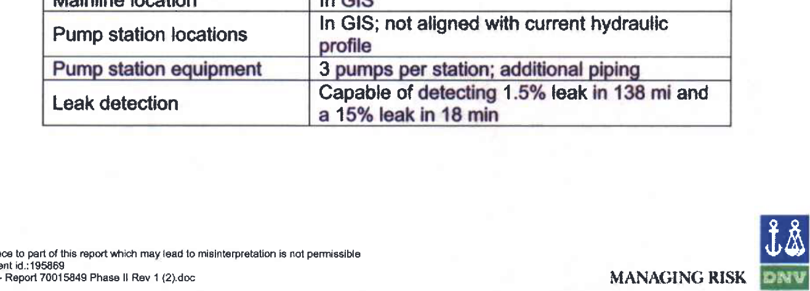

---
jupyter:
  jupytext:
    formats: ipynb,Rmd
    text_representation:
      extension: .Rmd
      format_name: rmarkdown
      format_version: '1.1'
      jupytext_version: 1.2.1
  kernelspec:
    display_name: R 3.6.1
    language: R
    name: ir361
---

<!-- #region {"slideshow": {"slide_type": "slide"}} -->
# Recap 2020-04-07
<!-- #endregion -->


Image: Belle Fourche pipeline leak on Dec 05, 2016. https://bismarcktribune.com/news/state-and-regional/oil-spill-in-creek-originally-underestimated-making-it-one-of/article_93c58fa0-3d22-554c-a1ae-cfb08b248aee.html

<!-- #region {"slideshow": {"slide_type": "subslide"}} -->
1. Stronger focus on onshore spills
2. Inconsistent metrics
3. Different commodities - findings about progress
4. Data availability
5. Next steps - qualitative insights - oil spills
6. Developing empirical questions
<!-- #endregion -->

<!-- #region {"slideshow": {"slide_type": "subslide"}} -->
**Key question**

* How do I deal with the limitations of the data on the environmental impacts?
* Since these environmental impacts are what I am interested in.
<!-- #endregion -->

<!-- #region {"slideshow": {"slide_type": "slide"}} -->
## Setup
<!-- #endregion -->

```{r slideshow={'slide_type': 'subslide'}}
library(tidyverse)
library(oildata)
library(ggmap)
library(gridExtra)
```

```{r slideshow={'slide_type': 'subslide'}}
relevant_cols <- quo(-c(narrative, DATAFILE_AS_OF, CAUSE, cost, recovered))
head(select(incidents, !! relevant_cols))
```

```{r slideshow={'slide_type': 'subslide'}}
pipelines_y_c <- pipelines %>%
    filter(on_offshore == "onshore") %>%
    filter(commodity %in% c("crude", "hvl", "rpp")) %>%
    group_by(year, commodity) %>%
    summarize(!!! oildata::pipelines_consolidation) %>%
    mutate(cost_per_mile = incidents_cost/miles, 
           cost_per_volume = incidents_cost/estimate_volume_all, 
           volume_per_mile = incidents_volume/miles,
           volume_per_volume = incidents_volume/estimate_volume_all,
           inc_per_mile = incidents/miles, 
           inc_per_volume = incidents/estimate_volume_all,
           sign_inc_per_mile = significant_incidents/miles,
           sign_inc_per_volume = significant_incidents/estimate_volume_all) %>%
    pivot_longer(cols = -c(year, commodity), names_to = "variable", values_to = "value")

glimpse(pipelines_y_c)
```

<!-- #region {"slideshow": {"slide_type": "slide"}} -->
## 1. Stronger focus on onshore
<!-- #endregion -->

<!-- #region {"slideshow": {"slide_type": "subslide"}} -->


Image:Keystone pipeline leak on Oct 29, 2019. https://www.rawstory.com/2019/11/it-happens-over-and-over-and-over-and-over-keystone-pipeline-leaks-at-least-383000-gallons-of-crude-oil-in-north-dakota/
<!-- #endregion -->

<!-- #region {"slideshow": {"slide_type": "subslide"}} -->
 
Image: Kalamazoo River oil spill
<!-- #endregion -->

```{r slideshow={'slide_type': 'subslide'}}
packageVersion("oildata")
```

```{r slideshow={'slide_type': 'fragment'}}
head(pipelines)
```

<!-- #region {"slideshow": {"slide_type": "slide"}} -->
## 2. Inconsistent metrics
<!-- #endregion -->

```{r slideshow={'slide_type': 'subslide'}}
crude_trends <- pipelines_y_c %>%
    filter(commodity == "crude") %>%
    filter(variable %in% c("significant_incidents", "incidents_volume", "net_loss_volume", 
                           "incidents_cost", "volume_per_volume", "volume_per_mile")) %>%
    ggplot(aes(x=year, y=value)) +
        facet_wrap(commodity ~ variable, scale = "free") +
        geom_line() +
        scale_y_continuous(limits = c(0, NA)) +
        geom_smooth(method = "lm", se = T)

options(repr.plot.width=8, repr.plot.height=6)
```

```{r slideshow={'slide_type': 'subslide'}}
crude_trends
```

<!-- #region {"slideshow": {"slide_type": "subslide"}} -->
**There are trends that stand out in terms of one metric, but not in term of the other metrics.**

**Why is that?**
<!-- #endregion -->

<!-- #region {"slideshow": {"slide_type": "subslide"}} -->
### The event in question
<!-- #endregion -->

```{r}
enbridge <- top_n(filter(incidents, commodity == "crude"), 1, cost_1984)
select(enbridge, !! relevant_cols)
```

---

**Note**

* Spill volume: ~20k barrels
* Net spill: only ~2k barrels
* *But* cost: almost 1b (in 1984 USD)

```{r slideshow={'slide_type': 'subslide'}}
enbridge$narrative %>%
    DataAnalysisTools::jupyter_styling(font_size = 14)
```

<!-- #region {"slideshow": {"slide_type": "subslide"}} -->
---

**Note**

* Oil was spilled into water way, and quickly carried downstream
* Company recovered the oil from the water way, meaning by digging up the river bed
<!-- #endregion -->

<!-- #region {"slideshow": {"slide_type": "subslide"}} -->
### For comparison - largest spill by volume
<!-- #endregion -->

```{r}
most_spilled <- top_n(filter(incidents, commodity != "hvl"), 1, volume)
select(most_spilled, !! relevant_cols)
```

```{r slideshow={'slide_type': 'subslide'}}
most_spilled$narrative
```

---

**Clearly, volume recovered does not mean the same for these two incidents.**

* In the first incident the oil had to be dug up with the soil
* In the second incident, it could simply be recovered from a dike system

<!-- #region {"slideshow": {"slide_type": "slide"}} -->
## 3. Findings about progress
<!-- #endregion -->

```{r slideshow={'slide_type': 'skip'}}
trends <- pipelines_y_c %>%
    filter(variable %in% c("miles", "incidents_volume", "net_loss_volume", "incidents_cost")) %>%
    ggplot(aes(x=year, y=value)) +
        facet_wrap(commodity ~ variable, scale = "free") +
        geom_line() +
        scale_y_continuous(limits = c(0, NA)) +
        geom_smooth(method = "lm", se = T)

options(repr.plot.width=8, repr.plot.height=6)
```

```{r slideshow={'slide_type': 'subslide'}}
trends
```

<!-- #region {"slideshow": {"slide_type": "subslide"}} -->
---

**Takeaways**

* Clear downward trends exist only for crude
* For crude, the 2010 incidents did not lead to a change in trajectory
<!-- #endregion -->

```{r slideshow={'slide_type': 'skip'}}
trends_standardized <- pipelines_y_c %>%
    filter(variable %in% c("volume_per_volume", "volume_per_mile", "cost_per_mile", "cost_per_volume")) %>%
    ggplot(aes(x=year, y=value)) +
        facet_wrap(commodity ~ variable, scale = "free") +
        geom_line() +
        scale_y_continuous(limits = c(0, NA)) +
        geom_smooth(method = "lm", se = T)

options(repr.plot.width=8, repr.plot.height=6)
```

```{r slideshow={'slide_type': 'subslide'}}
trends_standardized
```

<!-- #region {"slideshow": {"slide_type": "subslide"}} -->
---

Same as above - learning may only be evident for crude.
<!-- #endregion -->

<!-- #region {"slideshow": {"slide_type": "slide"}} -->
## 4. Data availability
<!-- #endregion -->

<!-- #region {"slideshow": {"slide_type": "subslide"}} -->
### 1990s data graphed
<!-- #endregion -->

```{r}
pre <- readxl::read_excel("../resources/pipelines_pre_2000.xls", skip = 1, na = "U", n_max=6)
pre$`...1` <- c("oil_total", "crude", "rpp", "gas_total", "gas_distribution", "hvl")

head(pre)
```

```{r slideshow={'slide_type': 'skip'}}
pre_2000 <- pivot_longer(pre, -`...1`)
colnames(pre_2000) <- c("commodity", "year", "miles")
pre_2000$year <- as.numeric(pre_2000$year)

incidents_y <- incidents %>%
    filter(commodity %in% c("crude", "rpp", "hvl")) %>%
    group_by(year, commodity) %>%
    summarize(spill_volume = sum(volume, na.rm = T), 
              net_loss = sum(net_loss, na.rm = T), 
              n_significant = sum(significant, na.rm = T), 
              cost = sum(cost_1984, na.rm = T))

pre_2000_trends <- left_join(pre_2000, incidents_y, by = c("year", "commodity"))

pre_2000_graphed <- pre_2000_trends %>%
    filter(commodity %in% c("crude", "hvl", "rpp")) %>%
    filter(!is.na(spill_volume & miles) & year < 2001) %>%
    pivot_longer(-c(year, commodity), names_to = "variable") %>%
    filter(variable != "n_significant") %>%
    ggplot(aes(x=year, value)) +
        facet_wrap(commodity ~ variable, scales = "free") +
        geom_line() + 
        geom_point(size = 0.7) +
        geom_smooth(method = "lm", se = T) +
        scale_y_continuous(limits = c(0, NA)) +
        scale_x_continuous(breaks = c(1990, 1992, 1994, 1996, 1998, 2000)) +
        labs(y = NULL)

options(repr.plot.width=8, repr.plot.height=6)
```

```{r slideshow={'slide_type': 'subslide'}}
pre_2000_graphed
```

<!-- #region {"slideshow": {"slide_type": "subslide"}} -->
---

**What's the problem**

* Pre-2002 data available for incidents (starting 1986), not for pipeline network
* Data on pipeline network available from industry association (1960-2000; only pipeline miles)
* Methodology is different
<!-- #endregion -->

<!-- #region {"slideshow": {"slide_type": "slide"}} -->
## 5. Next steps - qualitative insights - oil spills
<!-- #endregion -->

<!-- #region {"slideshow": {"slide_type": "subslide"}} -->
### By individual spills
<!-- #endregion -->

```{r slideshow={'slide_type': 'skip'}}
top_volume <- incidents %>%
    top_n(10, volume) %>%
    arrange(desc(volume)) %>%
    mutate(n = 1:n()) %>%
    ggplot(aes(n, volume)) + 
        geom_col(color = "black", fill = "tan") +
        geom_text(aes(label = paste(name, "-", year)), angle = 90, 
                  hjust = c(1, rep(0, 9)), nudge_y = c(-1000, rep(1000, 9))) +
        scale_x_continuous(breaks = 1:10) +
        labs(x = NULL, y = "Volume spilled (in barrels)")

options(repr.plot.width=8, repr.plot.height=6)
```

```{r slideshow={'slide_type': 'subslide'}}
top_volume
```

```{r slideshow={'slide_type': 'skip'}}
incidents$name_short <- substr(incidents$name, 1, 15)
incidents$year_short <- substr(incidents$year, 3, 4)

top_net_loss <- incidents %>%
    top_n(10, net_loss) %>%
    arrange(desc(net_loss)) %>%
    mutate(n = 1:n()) %>%
    ggplot(aes(n, net_loss)) + 
        geom_col(color = "black", fill = "tan") +
        geom_text(aes(label = paste0(name_short, " '", year_short)), angle = 90, 
                  hjust = c(1, rep(0, 9)), nudge_y = c(-1000, rep(1000, 9))) +
        labs(x = NULL, y = "Net loss (in barrels)") +
        theme(axis.title.x=element_blank(), axis.text.x=element_blank(), axis.ticks.x=element_blank())

top_cost <- incidents %>%
    top_n(10, cost) %>%
    arrange(desc(cost)) %>%
    mutate(n = 1:n()) %>%
    ggplot(aes(n, cost)) + 
        geom_col(color = "black", fill = "tan") +
        geom_text(aes(label = paste(name_short, " '", year_short)), angle = 90, 
                  hjust = c(1, rep(0, 9)), nudge_y = c(-10000000, rep(10000000, 9))) +
        labs(x = NULL, y = "Net loss (in barrels)") +
        theme(axis.title.x=element_blank(), axis.text.x=element_blank(), axis.ticks.x=element_blank())

top_injuries <- incidents %>%
    top_n(10, injuries) %>%
    arrange(desc(injuries)) %>%
    mutate(n = 1:n()) %>%
    ggplot(aes(n, injuries)) + 
        geom_col(color = "black", fill = "tan") +
        geom_text(aes(label = paste(name_short, "'", year_short)), angle = 90, 
                  hjust = c(1, 1, rep(0, 8)), nudge_y = c(-0.05, -0.05, rep(0.05, 8))) +
        labs(x = NULL, y = "Net loss (in barrels)") +
        scale_y_log10() +
        theme(axis.title.x=element_blank(), axis.text.x=element_blank(), axis.ticks.x=element_blank())

top_fatalities <- incidents %>%
    top_n(10, fatalities) %>%
    arrange(desc(fatalities)) %>%
    mutate(n = 1:n()) %>%
    top_n(10, n) %>%
    ggplot(aes(n, fatalities)) + 
        geom_col(color = "black", fill = "tan") +
        geom_text(aes(label = paste(name_short, "'", year_short)), angle = 90, 
                  hjust = c(1), nudge_y = c(-0.05)) +
        labs(x = NULL, y = "Net loss (in barrels)") +
        theme(axis.title.x=element_blank(), axis.text.x=element_blank(), axis.ticks.x=element_blank())

top_grid <- arrangeGrob(top_net_loss, top_cost, top_injuries, top_fatalities, ncol=2)
```

```{r slideshow={'slide_type': 'subslide'}}
grid::grid.draw(top_grid)
```

<!-- #region {"slideshow": {"slide_type": "subslide"}} -->
**Next step: Picking up the largest incidents here and create spider charts**
<!-- #endregion -->

<!-- #region {"slideshow": {"slide_type": "subslide"}} -->
### By individual pipelines
<!-- #endregion -->

```{r slideshow={'slide_type': 'subslide'}}
keystone_candidates <- subset(incidents_2010, ID == 32334)

keystone_candidates$long <- as.numeric(keystone_candidates$long)
keystone_candidates$lat <- as.numeric(keystone_candidates$lat)

# maps_key <- readChar("../../maps_key.txt", file.info("../../maps_key.txt")$size)
# register_google(maps_key)
# us <- ggmap::get_googlemap("US", zoom = 4)
# saveRDS(us, "../us_map.rds")
us <- readRDS("../resources/us_map.rds")

keystone_operator_spills <- ggmap(us) +
    geom_point(data = keystone_candidates, aes(x=long, y=lat, size = volume), alpha = 0.5)
```

```{r slideshow={'slide_type': 'subslide'}}
keystone_operator_spills
```

<!-- #region {"slideshow": {"slide_type": "subslide"}} -->
 

The pipeline - for comparison.
<!-- #endregion -->

<!-- #region {"slideshow": {"slide_type": "subslide"}} -->
### By learning processes
<!-- #endregion -->

<!-- #region {"slideshow": {"slide_type": "subslide"}} -->



*Source: Draft Environmental Impact Assessment, DNV Consulting 2006.*
<!-- #endregion -->

<!-- #region {"slideshow": {"slide_type": "subslide"}} -->


*Source: Draft Environmnental Impact Assessment, DNV Consulting 2006.*
<!-- #endregion -->

<!-- #region {"slideshow": {"slide_type": "fragment"}} -->
---

In other words, the operator expects **one significant spill every 7 years** from the get-go. 
<!-- #endregion -->

<!-- #region {"slideshow": {"slide_type": "slide"}} -->
## 6. Developing empirical questions
<!-- #endregion -->

<!-- #region {"slideshow": {"slide_type": "subslide"}} -->
### Backdrop - learning literature
<!-- #endregion -->

Going steady - especially through latest writing initiative

<!-- #region {"slideshow": {"slide_type": "subslide"}} -->
### The problem at hand
<!-- #endregion -->

* I am interested in the environmental impact
* But the numbers are not readily interpretable/comparable

---

Commonplace proble in research?

<!-- #region {"slideshow": {"slide_type": "subslide"}} -->
### In general
<!-- #endregion -->

1. Progress as outcome of experience
2. Ownership
3. Progress as outcome of rare events/failure
4. Qualitative route - incident reports and (non-)progress
