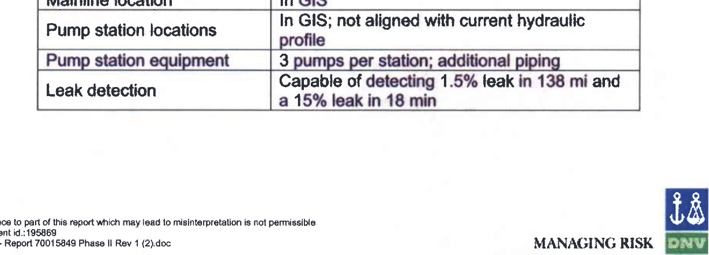
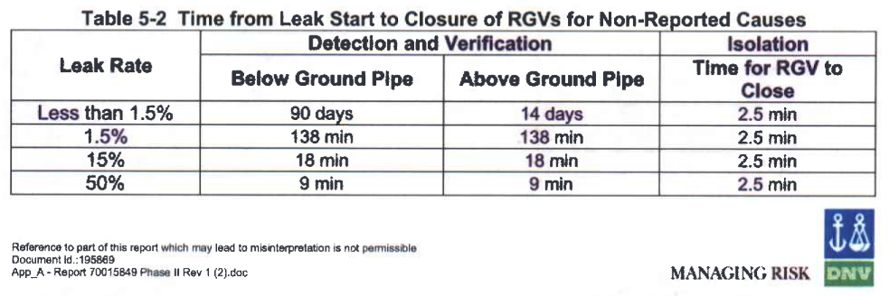
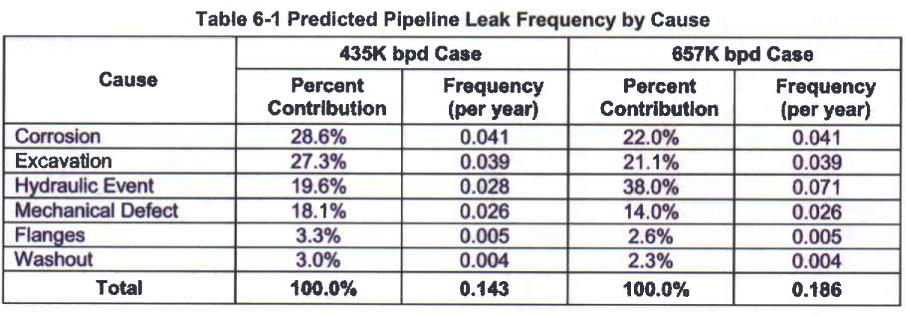

---
jupyter:
  jupytext:
    formats: ipynb,Rmd
    text_representation:
      extension: .Rmd
      format_name: rmarkdown
      format_version: '1.1'
      jupytext_version: 1.2.1
  kernelspec:
    display_name: R 3.6.1
    language: R
    name: ir361
---

# Research Progress Meeting 2020-04-02


Image:Keystone pipeline leak on Oct 29, 2019. https://www.rawstory.com/2019/11/it-happens-over-and-over-and-over-and-over-keystone-pipeline-leaks-at-least-383000-gallons-of-crude-oil-in-north-dakota/

```{r slideshow={'slide_type': 'skip'}}
library(oildata)
library(tidyverse)
library(ggmap)

maps_key <- readChar("../../maps_key.txt", file.info("../../maps_key.txt")$size)
register_google(maps_key)

head(select(incidents_2010, -narrative))
```

```{r slideshow={'slide_type': 'skip'}}
packageVersion("oildata")
```

<!-- #region {"slideshow": {"slide_type": "subslide"}} -->



*Source: Draft Environmental Impact Assessment, DNV Consulting 2006.*
<!-- #endregion -->

<!-- #region {"slideshow": {"slide_type": "subslide"}} -->


*Source: Draft Environmnental Impact Assessment, DNV Consulting 2006.*
<!-- #endregion -->

<!-- #region {"slideshow": {"slide_type": "fragment"}} -->
---

In other words, the operator expects **one significant spill every 7 years** from the get-go. 
<!-- #endregion -->

<!-- #region {"slideshow": {"slide_type": "subslide"}} -->
### Let's quickly investigate the reality of keystone.
<!-- #endregion -->

 

```{r slideshow={'slide_type': 'subslide'}}
oildata::add_company_names(32334)
```

```{r}
keystone_candidates <- subset(incidents_2010, ID == 32334)
nrow(keystone_candidates)
```

```{r slideshow={'slide_type': 'skip'}}
keystone_candidates$long <- as.numeric(keystone_candidates$long)
keystone_candidates$lat <- as.numeric(keystone_candidates$lat)
```

```{r}
# us <- ggmap::get_googlemap("US", zoom = 4)
# saveRDS(us, "us_map.rds")
us <- readRDS("us_map.rds")

keystone_operator_spills <- ggmap(us) +
    geom_point(data = keystone_candidates, aes(x=long, y=lat, size = volume), alpha = 0.5)

options(repr.plot.width=8, repr.plot.height=6)
```

```{r slideshow={'slide_type': 'subslide'}}
keystone_operator_spills
```

<!-- #region {"slideshow": {"slide_type": "subslide"}} -->
## What, then, does safe mean?
<!-- #endregion -->

* Safety has a very specific meaning in the industry.
* There is an expected performance. The environmental impact assessment implies that some incidents are to be expected.
* When leaks occur "that's ok", as long as they are detected fast and addressed.

<!-- #region {"slideshow": {"slide_type": "subslide"}} -->
Maybe I should mention how in the report, incident detection is the focus, rather than prevention. Thus, the incident count still matters? But in a paradox fashion. On the one hand, the incident count increasing is a sign progress - detection works. On the other hand, the incident count not going down is a sign of lack of progress. Now, the new Canadian initaitive toward no incidents might challenge that.
<!-- #endregion -->

<!-- #region {"slideshow": {"slide_type": "slide"}} -->
## Plotting the pre-2002 trend
<!-- #endregion -->

<!-- #region {"slideshow": {"slide_type": "subslide"}} -->
Pre-2000 data on pipeline network available from https://www.bts.gov/archive/publications/national_transportation_statistics/2009/table_01_10
<!-- #endregion -->

```{r slideshow={'slide_type': 'skip'}}
pre <- readxl::read_excel("table_01_10.xls", skip = 1, na = "U", n_max=6)
pre$`...1` <- c("oil_total", "crude", "rpp", "gas_total", "gas_distribution", "hvl")

head(pre)
```

```{r slideshow={'slide_type': 'skip'}}
pre_2000 <- pivot_longer(pre, -`...1`)
colnames(pre_2000) <- c("commodity", "year", "miles")
pre_2000$year <- as.numeric(pre_2000$year)
head(pre_2000)
```

```{r slideshow={'slide_type': 'skip'}}
incidents_y <- incidents %>%
    filter(commodity %in% c("crude", "rpp", "hvl")) %>%
    group_by(year, commodity) %>%
    summarize(spill_volume = sum(volume, na.rm = T), 
              net_loss = sum(net_loss, na.rm = T), 
              n_significant = sum(significant, na.rm = T), 
              cost = sum(cost_1984, na.rm = T))

head(incidents_y)
```

```{r slideshow={'slide_type': 'skip'}}
pre_2000_trends <- left_join(pre_2000, incidents_y, by = c("year", "commodity"))
head(pre_2000_trends)
```

```{r slideshow={'slide_type': 'skip'}}
pre_2000_graphed <- pre_2000_trends %>%
    filter(commodity %in% c("crude", "hvl", "rpp")) %>%
    filter(!is.na(spill_volume & miles) & year < 2001) %>%
    pivot_longer(-c(year, commodity), names_to = "variable") %>%
    filter(variable != "n_significant") %>%
    ggplot(aes(x=year, value)) +
        facet_wrap(commodity ~ variable, scales = "free") +
        geom_line() + 
        geom_point(size = 0.7) +
        geom_smooth(method = "lm", se = F) +
        scale_y_continuous(limits = c(0, NA)) +
        scale_x_continuous(breaks = c(1990, 1992, 1994, 1996, 1998, 2000)) +
        labs(y = NULL)
```

```{r slideshow={'slide_type': 'subslide'}}
pre_2000_graphed
```
