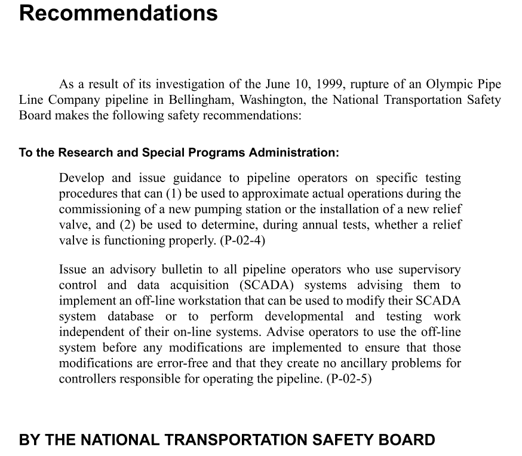

---
jupyter:
  jupytext:
    formats: ipynb,Rmd
    text_representation:
      extension: .Rmd
      format_name: rmarkdown
      format_version: '1.1'
      jupytext_version: 1.2.1
  kernelspec:
    display_name: R 3.6.1
    language: R
    name: ir361
---

<!-- #region {"slideshow": {"slide_type": "slide"}} -->
### Research Progress Meeting 2020-04-16


Source: https://www.houstonchronicle.com/news/houston-texas/houston/article/Houston-no-stranger-to-chemical-plant-fires-13697557.php#photo-17090239. A video of the fire can be seen at https://abc13.com/river-fire-flood-san-jacinto-on/1563118/.
<!-- #endregion -->

<!-- #region {"slideshow": {"slide_type": "subslide"}} -->
### Purpose

* Looking at the incidents
* Takeaways on changes made after incidents/learning
* Takeaways on impacts
<!-- #endregion -->

<!-- #region {"slideshow": {"slide_type": "slide"}} -->
## Setup
<!-- #endregion -->

```{r slideshow={'slide_type': 'subslide'}}
library(oildata)
library(tidyverse)
library(gridExtra)
library(glue)

packageVersion("oildata")
```

```{r slideshow={'slide_type': 'subslide'}}
incidents <- subset(incidents, commodity %in% c("hvl", "rpp", "crude"))

glimpse(incidents)
```

```{r slideshow={'slide_type': 'skip'}}
print_inc <- function(inc) {
    lat_long <- paste0(inc$long,'/',inc$lat)
    
    info <- glue("
General information                          ||  Outcomes
                                             ||                         
Company name:   {sprintf('%27s', inc$name)}  ||  Spill volume:   {sprintf('%12.f', inc$volume)}
Commodity: {sprintf('%32s', inc$commodity)}  ||  Recovered:      {sprintf('%12.f', inc$recovered)}
Date:           {sprintf('%27s', inc$date)}  ||  Net loss:       {sprintf('%12.f', inc$net_loss)}
Lat/Long:       {sprintf('%27s', lat_long)}  ||  Cost:           {sprintf('%12.f', inc$cost)}
State:         {sprintf('%28s', inc$state)}  ||  Cost (USD 1984):{sprintf('%12.f', inc$cost_1984)}
                                             ||  Injuries:       {sprintf('%12.f', inc$injuries)}
                                             ||  Fatalities:     {sprintf('%12.f', inc$fatalities)}                                                                
Causes                                                                 
                                                                 
Cause (self_selected):               {inc$CAUSE}                                                                 
Cause (coded by PHMSA):              {inc$cause}                                                                 
Subcause (coded by PHMSA):           {inc$subcause}                                                                 
System that caused the incident:     {inc$system}                                                                 
Part that caused the incident:       {inc$item}                                                                 
Year that the part was installed:    {inc$installation_year}                                                                 
Year that the part was manufactured: {inc$manufacture_year}                                                                 
                                                                 
                                                                 
Other impact                                                               
                                                                 
Water contamination:                            {inc$water_contamination}  
Did a fire occur?                               {inc$fire}                 
Did an explosion occur?                         {inc$explosion}            
Need for surface water remediation anticipated? {inc$surface_water_remediation}
Need for groundwater remediation anticipated?   {inc$groundwater_remediation}
Need for soil remediation anticipated?          {inc$soil_remediation}
Need for vegetation remediation anticipated?    {inc$vegetation_remediation}
Need for wildlife remediation anticipated?      {inc$wildlife_remediation}                                                                 
")
    print(info)
} 
```

<!-- #region {"slideshow": {"slide_type": "slide"}} -->
## Incidents - metrics
<!-- #endregion -->

```{r slideshow={'slide_type': 'skip'}}
top_volume <- incidents %>%
    top_n(10, volume) %>%
    arrange(desc(volume)) %>%
    mutate(n = 1:n()) %>%
    ggplot(aes(n, volume)) + 
        geom_col(color = "black", fill = "tan") +
        geom_text(aes(label = paste(name, "-", year)), angle = 90, 
                  hjust = c(1, rep(0, 9)), nudge_y = c(-1000, rep(1000, 9))) +
        scale_x_continuous(breaks = 1:10) +
        labs(x = NULL, y = "Volume spilled (in barrels)")

options(repr.plot.width=8, repr.plot.height=6)
```

```{r slideshow={'slide_type': 'subslide'}}
top_volume
```

```{r slideshow={'slide_type': 'skip'}}
incidents$name_short <- substr(incidents$name, 1, 15)
incidents$year_short <- substr(incidents$year, 3, 4)

top_net_loss <- incidents %>%
    top_n(10, net_loss) %>%
    arrange(desc(net_loss)) %>%
    mutate(n = 1:n()) %>%
    ggplot(aes(n, net_loss)) + 
        geom_col(color = "black", fill = "tan") +
        geom_text(aes(label = paste0(name_short, " '", year_short)), angle = 90, 
                  hjust = c(1, rep(0, 9)), nudge_y = c(-1000, rep(1000, 9))) +
        labs(x = NULL, y = "Net loss (in barrels)") +
        theme(axis.title.x=element_blank(), axis.text.x=element_blank(), axis.ticks.x=element_blank())

top_cost <- incidents %>%
    top_n(10, cost_1984) %>%
    arrange(desc(cost_1984)) %>%
    mutate(n = 1:n()) %>%
    ggplot(aes(n, cost_1984)) + 
        geom_col(color = "black", fill = "tan") +
        geom_text(aes(label = paste(name_short, " '", year_short)), angle = 90, 
                  hjust = c(1, rep(0, 9)), nudge_y = c(-10000000, rep(10000000, 9))) +
        labs(x = NULL, y = "Cost (in 1984 USD)") +
        theme(axis.title.x=element_blank(), axis.text.x=element_blank(), axis.ticks.x=element_blank())

top_injuries <- incidents %>%
    top_n(10, injuries) %>%
    arrange(desc(injuries)) %>%
    mutate(n = 1:n()) %>%
    ggplot(aes(n, injuries)) + 
        geom_col(color = "black", fill = "tan") +
        geom_text(aes(label = paste(name_short, "'", year_short)), angle = 90, 
                  hjust = c(1, 1, rep(0, 8)), nudge_y = c(-0.05, -0.05, rep(0.05, 8))) +
        labs(x = NULL, y = "Number of injuries") +
        scale_y_log10() +
        theme(axis.title.x=element_blank(), axis.text.x=element_blank(), axis.ticks.x=element_blank())

top_fatalities <- incidents %>%
    top_n(10, fatalities) %>%
    arrange(desc(fatalities)) %>%
    mutate(n = 1:n()) %>%
    top_n(10, n) %>%
    ggplot(aes(n, fatalities)) + 
        geom_col(color = "black", fill = "tan") +
        geom_text(aes(label = paste(name_short, "'", year_short)), angle = 90, 
                  hjust = c(1), nudge_y = c(-0.05)) +
        labs(x = NULL, y = "Number of fatalities") +
        theme(axis.title.x=element_blank(), axis.text.x=element_blank(), axis.ticks.x=element_blank())

top_grid <- arrangeGrob(top_net_loss, top_cost, top_injuries, top_fatalities, ncol=2)
```

```{r slideshow={'slide_type': 'subslide'}}
grid::grid.draw(top_grid)
```

<!-- #region {"slideshow": {"slide_type": "subslide"}} -->
### Incident profiles
<!-- #endregion -->

```{r slideshow={'slide_type': 'skip'}}
incidents$name_short <- substr(incidents$name, 1, 23)
incidents$year_short <- substr(incidents$year, 3, 4)

top_10 <- top_n(incidents, 3, volume) %>%
    bind_rows(top_n(incidents, 3, net_loss)) %>%
    bind_rows(top_n(incidents, 3, cost)) %>%
    bind_rows(top_n(incidents, 3, injuries)) %>%
    bind_rows(top_n(incidents, 3, fatalities)) %>%
    unique()

top_10$log_injuries <- log(top_10$injuries + 1)
top_10$log_cost <- log(top_10$cost + 1)

top_10$nickname <- paste0(top_10$name_short, " '", top_10$year_short)
top_10$nickname <- ifelse(duplicated(top_10$nickname), paste0(top_10$nickname, "b"), top_10$nickname)

relevant_cols <- quos(c(nickname, incident_ID, volume, net_loss, log_cost, log_injuries, fatalities))

top_10_scaled <- top_10 %>%
    select(!!! relevant_cols) %>%
    mutate_at(vars(volume, net_loss, log_cost, log_injuries, fatalities), scales::rescale)
head(top_10_scaled)
```

```{r slideshow={'slide_type': 'skip'}}
incident_profiles_ID <- top_10_scaled %>%
    pivot_longer(-c(nickname, incident_ID)) %>%
    ggplot(aes(x = name, y = value)) +
        geom_col() +
        facet_wrap(incident_ID ~ nickname) +
        coord_flip() + 
        labs(y = NULL, x = NULL)
```

```{r slideshow={'slide_type': 'subslide'}}
incident_profiles_ID
```

<!-- #region {"slideshow": {"slide_type": "slide"}} -->
## San Bernadino train disaster '89 - gas explosion


The pipeline exploded 13 days after the train derailment. Damage to the pipeline had possibly resulted from the cleanup work.
<!-- #endregion -->

```{r slideshow={'slide_type': 'subslide'}}
inc <- subset(incidents, incident_ID == 19890074)
print_inc(inc)
```

```{r slideshow={'slide_type': 'subslide'}}
inc$narrative
```

<!-- #region {"slideshow": {"slide_type": "subslide"}} -->
### Incident description - San Bernadino train disaster

This pipeline spill is related to the San Bernadino train disaster. The train derailment immediately caused four deaths. According to the incident report by the National Transportation Safety Board, the pipeline ruptured 13 days after the incident. When it did, a fountain of gasoline shot out of the pipeline, and this fountain engulfed in flames. This fountain reportedly stood 10 feet higher than the rooftops of the village. The surrounding houses were doused in gasoline and burned down, two residents were burned alive.
<!-- #endregion -->

<!-- #region {"slideshow": {"slide_type": "subslide"}} -->
Also of notice:

* The reported metrics, which report that despite the two deaths, no oil was spilled and no damage cause, are obviously not correct.
* The incident report also touches on the cause of the pipeline incident.
    * Was the pipeline damaged even before the disaster? It was most likely damaged after the disaster during the clean up.
    * The person on duty attempted to start a pump multiple times within three minutes before he was informed of the fire by a San Bernadino official.
    * Was the pipeline improperly reopened? It was inspected after the disaster.
    * The cost of the rupture is reported as \\$453,433 for the damage to the houses, \\$300,000 for the loss of gasoline, \\$500,000 for repairing the pipelin, and \\$1,060,000 for environmental cleanup (p. 39).
    
---

Source: National Transportation Safety Board report (http://www.pipelinesafetytrust.com/docs/ntsb_doc26.pdf)
<!-- #endregion -->

<!-- #region {"slideshow": {"slide_type": "slide"}} -->
### Seminole '92


Aftermath of the pipeline explosion.

Source: https://www.theeagle.com/townnews/commerce/salt-dome-explosion-20-years-later/article_cab6128c-019b-11e2-8e7e-0019bb2963f4.html
<!-- #endregion -->

```{r slideshow={'slide_type': 'subslide'}}
inc <- subset(incidents, incident_ID == 19920109)
print_inc(inc)
```

```{r slideshow={'slide_type': 'subslide'}}
inc$narrative
```

<!-- #region {"slideshow": {"slide_type": "subslide"}} -->
### Incident description - Seminole '92

Source: https://www.nytimes.com./1992/04/08/us/gas-explosion-tears-through-texas-pastures.html

* "Several homes were left in shambles one to two miles from the explosion and rolling pasture was charred."
* "[F]our or five homes were destroyed", meaning that the cost was almost certainly not zero.
* There were also at least 17 animals such as cows and donkeys.
* Some residents were warned a few minutes ahead of time, when the company detected the leak.
<!-- #endregion -->

<!-- #region {"slideshow": {"slide_type": "subslide"}} -->
Source: https://www.theeagle.com/townnews/commerce/salt-dome-explosion-20-years-later/article_cab6128c-019b-11e2-8e7e-0019bb2963f4.html

* The residents were not aware that there was a gas storage facility (a salt dome) in their community.
* The worker on duty relied on the safety equipment.
* The safety equipment was faulty, and the cavern overfilled.
* "[G]overnment indifference was part of the problem. It took five years, but finally the U.S. Department of Transportation Pipeline and Hazardous Materials Safety Administration issued an advisory to operators of gas and hazardous liquid underground storage facilities: Henceforth, they were were required to create design guidelines and operation guidelines for salt domes, efforts that long ago should have been made mandatory."

---
* I sense a theme of (older? pre-2002?) incident reports being incomplete.
<!-- #endregion -->

<!-- #region {"slideshow": {"slide_type": "slide"}} -->
## Hurricane Rosa '94 (19940236 & 19940237)


Source: https://www.houstonchronicle.com/news/houston-texas/houston/article/Houston-no-stranger-to-chemical-plant-fires-13697557.php#photo-17090239. A video of the fire can be seen at https://abc13.com/river-fire-flood-san-jacinto-on/1563118/.
<!-- #endregion -->

<!-- #region {"slideshow": {"slide_type": "subslide"}} -->


Source: https://www.houstonchronicle.com/news/houston-texas/houston/article/Houston-no-stranger-to-chemical-plant-fires-13697557.php#photo-17090239.
<!-- #endregion -->

```{r slideshow={'slide_type': 'subslide'}}
inc <- subset(incidents, incident_ID == 19940236)
print_inc(inc)
```

```{r slideshow={'slide_type': 'subslide'}}
inc$narrative
```

<!-- #region {"slideshow": {"slide_type": "subslide"}} -->
### Incident description - Hurricane Rosa '94

* The high number stems from the fact that smoke filled a residential area.
* After the incident, Colonial Pipeline crossed the river with a new pipeline, that was burried 30 feet below the river bed. Reports do not indicate that pipelines in other places were replaced.

### the Pipeline Special Investigation Report

* 547 people received "mostly minor" (p. V) burn and inhalation injuries.
* Takeaways: "need for effective operational monitoring of pipelines and for the use of remote- or automatic-operated valves" (p. 1).
* The Colinial Pipeline spill occured hours after a competitor's pipeline had already ruptured.
* "After the first [!] explosion, fire and smoke rose about 300–400 feet into the air."
* Most of the oil was burned off in-situe, hence the burn and inhalation injuries.
* Engaging in discussion of semantics (p. 33).
* The burning of the commodity was found to be a wrong decision "because three different products [...] would be involved." (p. 44). On the other hand "[i]n hindsight, the in-situ burn was likely the most effective remedy measure that could have been undertaken" (p.44).
* Recommending action to industry associations, not lawmakers.
<!-- #endregion -->

<!-- #region {"slideshow": {"slide_type": "subslide"}} -->
Sidenote:

* No major pipeline damage was reported after Hurricane Harvey in 2017.

See also: https://www.nytimes.com./1994/10/21/us/flooding-sets-off-blast-of-major-fuel-pipeline.html
<!-- #endregion -->

<!-- #region {"slideshow": {"slide_type": "slide"}} -->
## Olympic Pipe Line '99


<!-- #endregion -->

```{r slideshow={'slide_type': 'subslide'}}
inc <- subset(incidents, incident_ID == 19990107)
print_inc(inc)
```

```{r slideshow={'slide_type': 'subslide'}}
inc$narrative
```

<!-- #region {"slideshow": {"slide_type": "subslide"}} -->
### Incident Report - Olympic Pipe Line '99

https://www.kiro7.com/news/north-sound-news/on-this-day-olympic-pipeline-explosion-in-bellingham-kills-three-in-1999/766933436/

* The death toll would have been much higher if it was not for the fact that two of the dead unknowingly set off fireworks near the spill.

#### Natural Resources & Environment article

* "[The resulting judgement] was the first time the federal government had asserted a violation of the [Pipeline Safety Act] in a judicial action, let alone a criminal action" (p. 33). Implying that pipeline spills usually do not lead to trials (under this act?).
* The ensuing legal battle threatened to bankrupt Olympic Pipe Line, causing a judge to impose a more lenient fine that the company could actually afford to pay.
* Multiple (I believe 3?) employees of two companies (Olympic Pipe Line and a "co-operator") went to jail.
<!-- #endregion -->

<!-- #region {"slideshow": {"slide_type": "subslide"}} -->
#### Pipeline Accident Report

* Surprising, how small and fragile a pipeline looks.
* The pipeline was damaged when water pipe was installed above it. The operator was found to have violated its supervisory duties.
* The pipeline section was tested with a smart pig before the incident. However, employees decided to disregard the findings which indicated that there might be damages - because the smart pig has had false positives before. 
* A nearby valve was also faulty.
* The SCADA system had crashed and the personnel on duty was very eager to restart the pipeline.
* Relatively thin on safety recommendations after the incident.
<!-- #endregion -->

<!-- #region {"slideshow": {"slide_type": "subslide"}} -->


Source: Pipeline Accident Report p.73
<!-- #endregion -->

```{r slideshow={'slide_type': 'skip'}}
inc <- subset(incidents, incident_ID == 20020383)
print_inc(inc)
```

test
